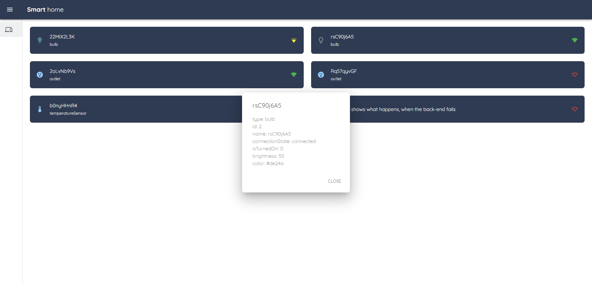

The goal of the project is to create part of smart home web's interface, which cover:

- [x] Connect to DB and get all user's devices
- [x] Connect socket on specific path and wait for messages
- [x] Show list of user's devices with basic information (name, type, range)
- [x] Dialog, which open, when user click on device. The box should be draggable and allow resizing (right bottom corner). After close holds the same position
- [x] Dynamically update list with value from socket (and potentially dialog)

## How does it work?

After connection to site, application is downloading devices and holds it in global store. After achieving a message from socket, it checks Redux to overwrite existing value or add it to the array of devices. Dialog which is located higher in root, observes a special flag in global store, which can be equal to specific object (device) or false. If the value is there, dialog is opening and showing every property. To avoid changing position after close, the dialog only change his visibility (is not getting re-render).

## Starting project

To run the project, we have to get care of server's and client's site.

Inside "_server" we need to install all dependencies:

```bash
$ npm install
```

then we can run server:

```bash
$ npm run start
```

Now we can move to "client" folder and basically do the same:

```bash
$ npm install
```

Client's site should be ready to start:

```bash
$ npm run start
```

After everything, React should open a browser with "localhost:3000". The server uses "localhost:1337".