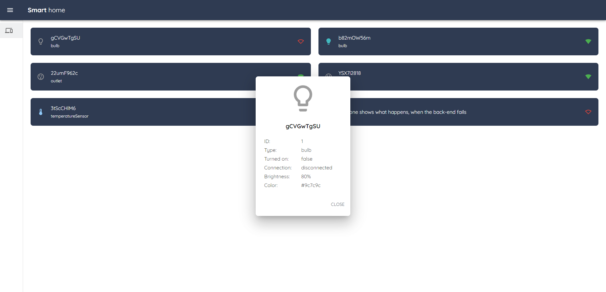

# 🏡 Smart Home Web Interface



## 📋 Project Overview

This project aims to develop a part of a smart home web interface with the following features:

- ✅ **Connect to Database:** Retrieve all user's devices.
- ✅ **WebSocket Connection:** Establish a WebSocket connection to a specific path and wait for messages.
- ✅ **Device List Display:** Show a list of user's devices with basic information (name, type, range).
- ✅ **Interactive Dialog:** Implement a draggable and resizable dialog box that opens when a device is clicked. The dialog retains its position after being closed.
- ✅ **Dynamic Updates:** Dynamically update the list with values from the WebSocket (and potentially the dialog).

## 🛠️ How It Works

Upon connecting to the site, the application downloads the devices and stores them in a global store. When a message is received from the WebSocket, Redux is used to:

- **Update** the existing device information.
- **Add** new devices to the array if they are not already present.

The dialog component, located higher in the component hierarchy, observes a special flag in the global store. This flag can be set to a specific device object or `false`. If the flag is set to a device:

- The dialog opens and displays the device's properties.
- To maintain its position after closing, the dialog's visibility is toggled without re-rendering.

## 🚀 Getting Started

### Prerequisites

Make sure you have the following installed on your machine:

- [Node.js](https://nodejs.org/) (v14 or higher)
- [npm](https://www.npmjs.com/)

### Installation

#### 📡 Server Setup

1. Navigate to the `_server` directory:
   ```bash
   cd _server
   ```
2. Install the server dependencies:
   ```bash
   npm install
   ```
3. Start the server:
   ```bash
   npm run start
   ```

The server will run on `localhost:1337`.

#### 💻 Client Setup

1. Navigate to the `client` directory:
   ```bash
   cd ../client
   ```
2. Install the client dependencies:
   ```bash
   npm install
   ```
3. Start the client:
   ```bash
   npm run start
   ```

The client will run on `localhost:3000`, and a browser should automatically open this address.

## 🧭 Navigation and Usage

Once both the server and client are running:

1. **Access the Interface:** Open your web browser and go to `http://localhost:3000`.
2. **View Devices:** The application will automatically fetch and display a list of your devices.
3. **Interact with Devices:** Click on any device to open the interactive dialog. You can drag and resize this dialog. Its position and size will be retained even after you close and reopen it.
4. **Real-Time Updates:** Any updates received via the WebSocket connection will dynamically update the device list and dialog.

## 🤝 Contributions

Contributions, issues, and feature requests are welcome! Feel free to check the [issues page](#).

## 📄 License

This project is licensed under the MIT License.
